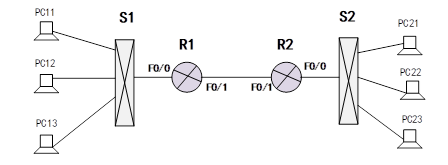
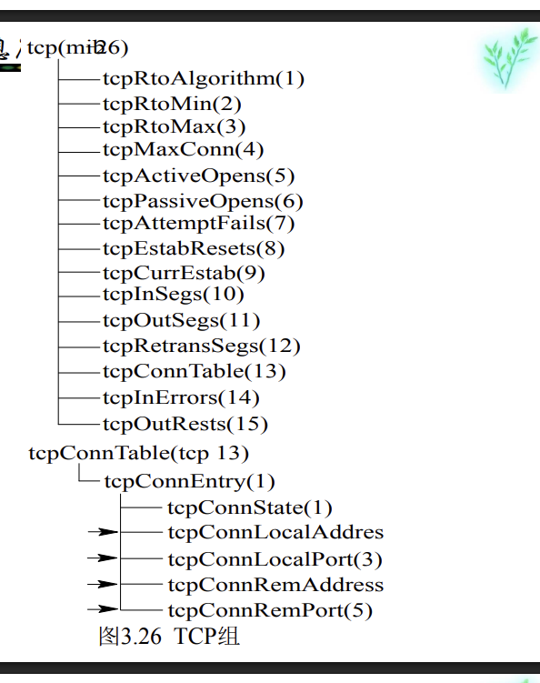

# 网络管理考试

## 题型
- 选择题： 20%
- 简答题： 40%
- 综合题： 60%

## 复习题涉及知识点
复习题中重点知识点可以看下面的笔记， [复习笔记]("https://www.yuque.com/g/u62833645/euqwww/ymhu1uigduhg94kt/collaborator/join?token=AxH8lgbfqCsqNsvW&source=doc_collaborator# 《网络管理考点知识梳理》")

复习的时候以ppt为主，整理考点知识点进行背诵。

## 考试题目 (2026回忆版)

### 选择题（10 * 2）
涉及
1. IPv6各种技术使用什么拓展头实现
2. 主动测量和被动测量的原理和优缺点
3. iFIT随流检测的作用
4. NETCONF和SNMP的区别
5. SNMPv1，v2，v3提供的PDU类型有哪些
6. NETCONF工作原理

> 选择题的知识比较零碎，也比较广，涉及几乎所有章节，需要将知识点对应的ppt看一遍，对一些内容要有印象。

### 简答题（4*10）
1. 简述网络管理系统的5大功能以及其作用
2. 简述RMOS的原理，比较RMOS和SNMP，RMOS有什么优势原理是什么
3. VXLAN的原理是什么，解决了哪些问题
4. SNMPv1的5种PDU类型是什么，功能是什么
> 这是2026年考的，老师应该是从复习题中随机抽4个

### 综合题(5 * 8)
可以说考的是你有没有做实验

1. 给定拓扑图，对图中的PC和路由器进行ipv6地址规划（一般与实验网络拓扑一致）
2. 写出所有路由器的配置命令（思科或者华为路由器风格），并配置动态路由协议(OSPF/RIP) 
3. PC11能够ping通R1，但是ping不通PC22，请给出你故障分析的流程，并给出可能的原因。
4. 解决问题后你会如何结合SNMP，NETCONF特点对上述问题进行预防和快速响应。
5. 给定MIB-2 TCP组的源代码，画出TCP组的子树

